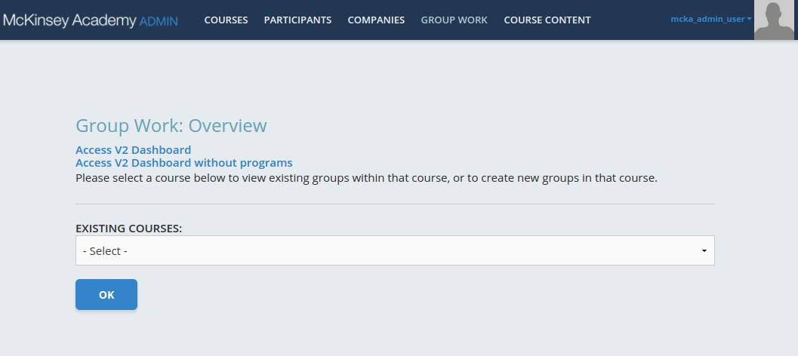
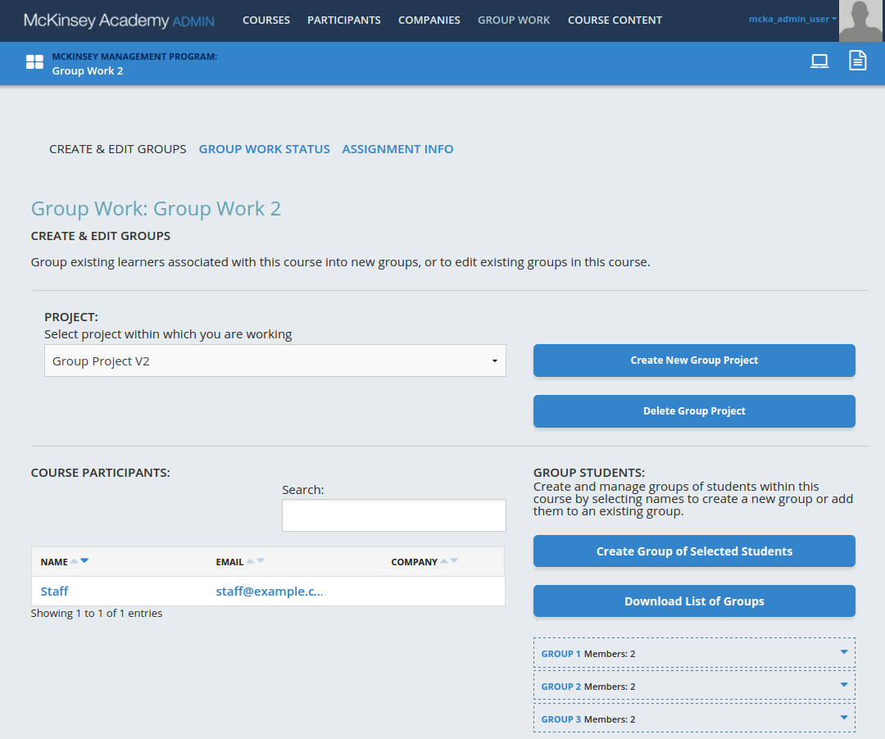
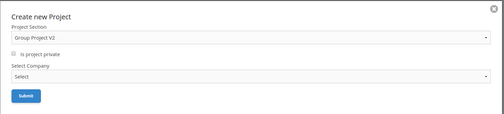
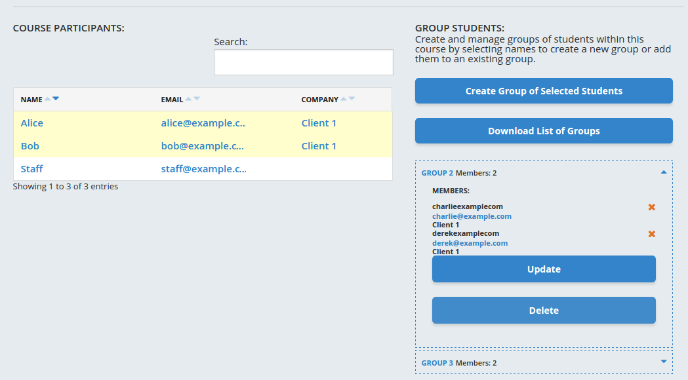
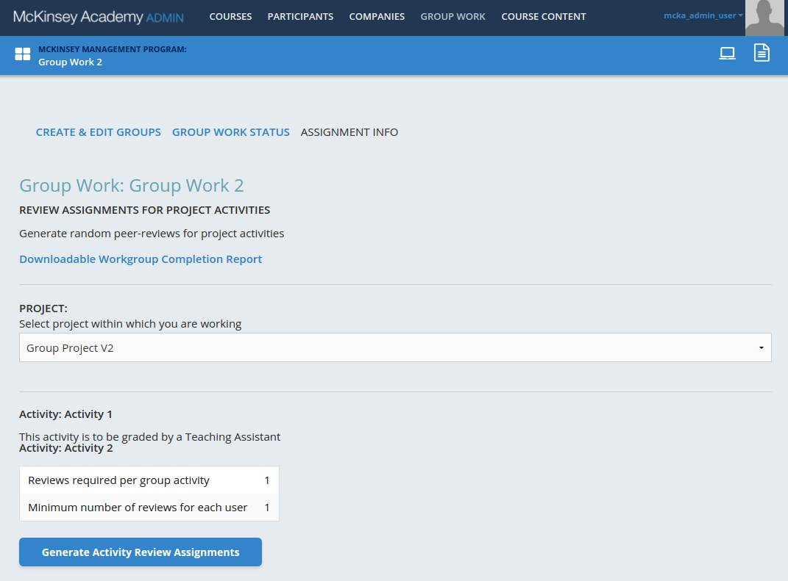

# Configuring Group Work V2

## General considerations

Unless otherwise specified, all actions are performed in McKA Apros 
admin interface, by McKA admin user. 

## Prerequisites

* [GroupWorkV2 XBlock][gwv2-xblock] is installed and enabled in LMS
* GroupWorkV2 XBlock is added and configured in a course
* Course is added to a Program
* There's at least one Client with seats in that Program
* Some Client's student are enrolled into a course with Group Work V2 XBlock 

[gwv2-xblock]: https://github.com/open-craft/xblock-group-project-v2

## Creating a Group Project for GroupWorkV2

Log in into McKA Apros admin interface and jump to GROUP WORK tab.

In "Existing Courses" dropdown choose a course with GroupWorkV2 XBlock. You will be redirected to Group Project configuration page.

The screenshot shows configured Group Project, so when you first arrive 
there you'll see something a bit different.
 
To create a new Group Project, click on "Create New Group Project" button. A popup will appear listing all course sections with GroupWork XBlocks 
(both V1 and V2).
 

Select a section from upper dropdown. There are two flavors of Group Projects: 

* Public - students from any Client can access Group Project
* Private only students from specified Client can access Group Project.

Note there might be at most one public Group Project per GroupWorkV2 section.

If you intend to create a private project, check "Private" checkbox and choose a Client in lower dropdown.

## Configuring Groups

To create groups, first choose students in "Course Participants" section, than click "Create Group of Selected Students".
This will create a group and add selected students to the group.

Group blocks in lower right corner are expandable - when expanded they display current list of students, and expose controls
to remove students from the group (red crosses next to student names), add new students to the group (select in "Course Participants"
table, than click "Update" in the group you want to add them), or delete the group altogether ("Delete" button).

## Configuring review assignments

GroupWorkV2 provides two kinds of reviews: Teaching Assistant review and Peer review.

For Teaching Assistant review, there's no need to configure review assignments, as any TA can review any group submissions.

For Peer review it is required to generate peer review assignments - each student get some groups assigned for review. To generate
review assignments, jump to "ASSIGNMENT INFO" subtab, choose a Group Project, locate an Activity with Peer review, check that 
review parameters are correct (fix in GroupWorkV2 editor interface in Studio if needed), than click "Generate Activity Review Assignments" - 
the assignments will be automatically generated and recorded.

